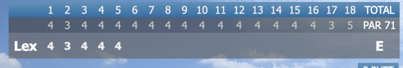
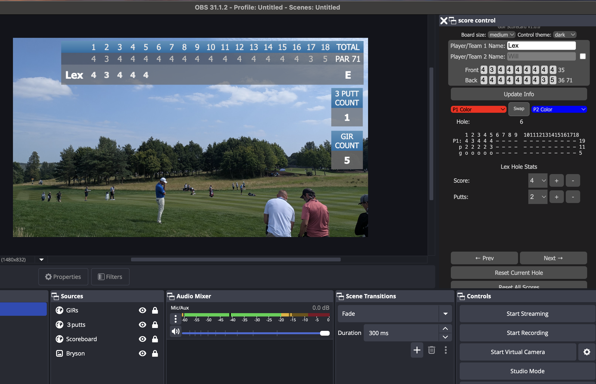
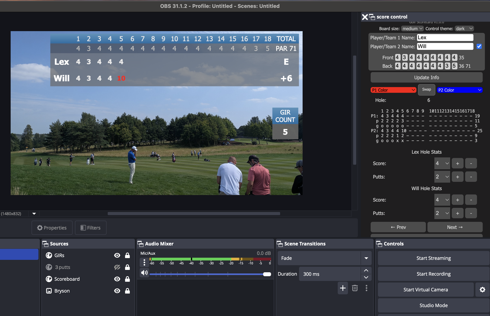
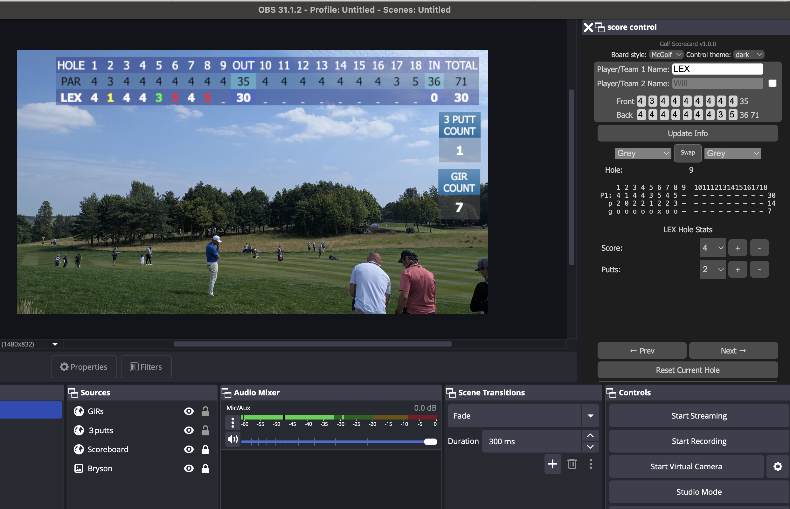
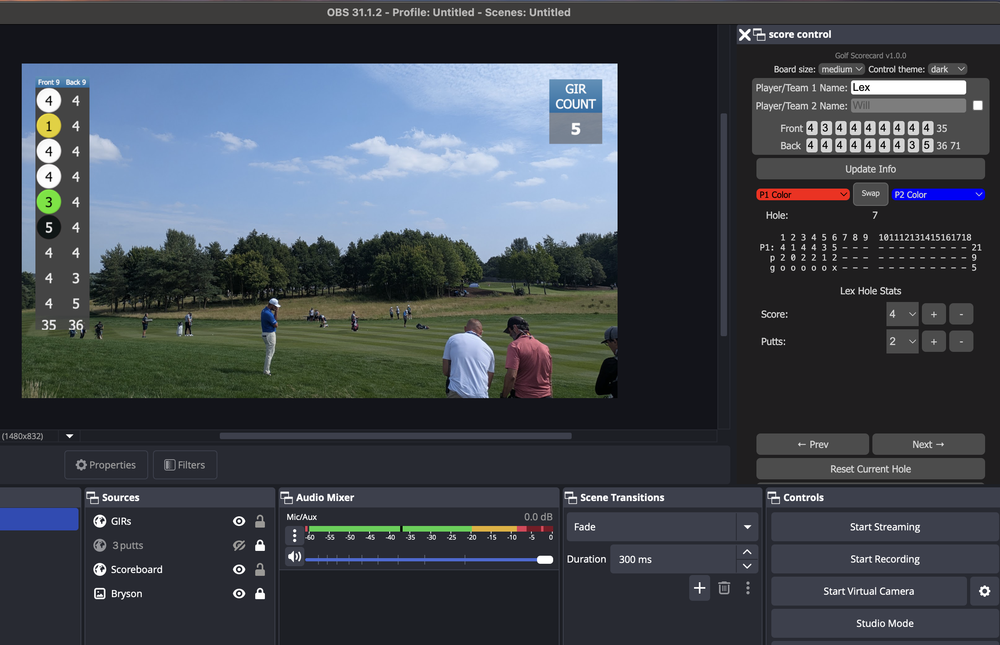

# Golf Scorecard addon for OBS

Based originally on [G4ScoreBoard](https://github.com/ngholson/g4ScoreBoard). This
is a javascript and html golf scorecard plugin for [OBS Studio](https://obsproject.com/).
The plugin along with OBS allows one to render a golf scorecard overlay when
streaming live golf broadcasts on platforms like YouTube.

With this plugin you will overlay a golf scorecard and round stats on
your OBS live feed.  The scorecard supports:

 - Multiple scorecards formats
 - Tracking and adding up scores and putts for 18 holes
 - Tracking up to 2 players
 - A GIR browser source `girs.html` to track greens in regulation for player 1's round.
 - A 3-Putt browser source `3putts.html` to track 3 putts for player 1's round.
 - Adjustable Opacity
 - Intuitive score entry controls in an OBS Dock

--------------------------------------------------------------

## Installation

Download the latest version from github [Tags](https://github.com/stffrdhrn/obsScorecard/tags)
or [Release](https://github.com/stffrdhrn/obsScorecard/releases) source code zip files.

Extract the downloaded file to the directory of your choosing, just make sure you know where to find it again.

### OBS V27.1 and lower Setup

 1. In OBS click on the Docks Menu from the top menu bar.
 2. Select "Custom Browser Docks".
 3. type a name (Scorecard) in the "Dock Name" box.
 4. input the full path to `control_panel.html` in the URL box.
   (example: `c:\users\yourname\desktop\scorecard\control_panel.html`)
 5. Click "Close"
 6. Select the scene you want the golf scorecard to display.
 7. Add a "Browser Source" -> "Create New" -> give it a name. click OK.
 8. Input the full path to `browser_source.html` in the URL box.
   (example: "c:\users\yourname\desktop\scorecard\browser_source.html")
 9. Set Width to 1920 and Height to 1080.
 10. click OK.

### OBS V27.2 and higher Setup

 1. In OBS click on the Docks Menu from the top menu bar.
 2. Select "Custom Browser Docks".
 3. type a name (Scorecard) in the "Dock Name" box.
 4. input the full path file URI to `control_panel.html` in the URL box.
   (example: `file:///c:/users/yourname/desktop/scorecard/control_panel.html`)
 5. Click "Close"
 6. Select the scene you want the scoreboard to display.
 7. Add a "Browser Source" -> "Create New" -> give it a name. click OK.
 8. Input the full path file URI to `browser_source.html` in the URL box.
   (example: `file:///c:/users/yourname/desktop/scorecard/browser_source.html`)
 9. Set Width to 1920 and Height to 1080.
 10. click OK.

### Stat Widgets Setup

The steps are the same as the `browser_source.html` setup, but use `girs.html`
and `3putts.html` as your browser source.

 1. Select the scene you want the stats to display.
 2. Add a "Browser Source" -> "Create New" -> give it a name. click OK.
 3. Input the full path file URI to `girs.html` or `3putts.html` in the URL box.
   (example: `file:///c:/users/yourname/desktop/scorecard/girs.html`)
 4. Set Width to 100 and Height to 100.
 5. click OK.

### Installing Hotkeys

 1. Click on "Tools" from the top menu in OBS.
 2. Select "Scripts" from the menu.
 3. Click the "+" in the lower left.
 4. Navigate to and select the "scorecard_hotkeys.lua" file that came with this download.
 5. Click Open.
 6. Open the "Settings" in OBS and navigate to the "Hotkeys" section.
 7. The scoreboard hotkeys all have the "Golf" prefix for easy identification.

--------------------------------------------------------------

## Examples

Single player mode, tracks current score and can render and GIR and 3PUTT counter.

If you enable the second player you can track another score.

## Themes

There are also a few different scoreboard themes available.

### McGolf

A scoreboard like that used on [McGolfinTV](https://www.youtube.com/@McGolfinTV).

### Vertical

A vertical compact scoreboard.

